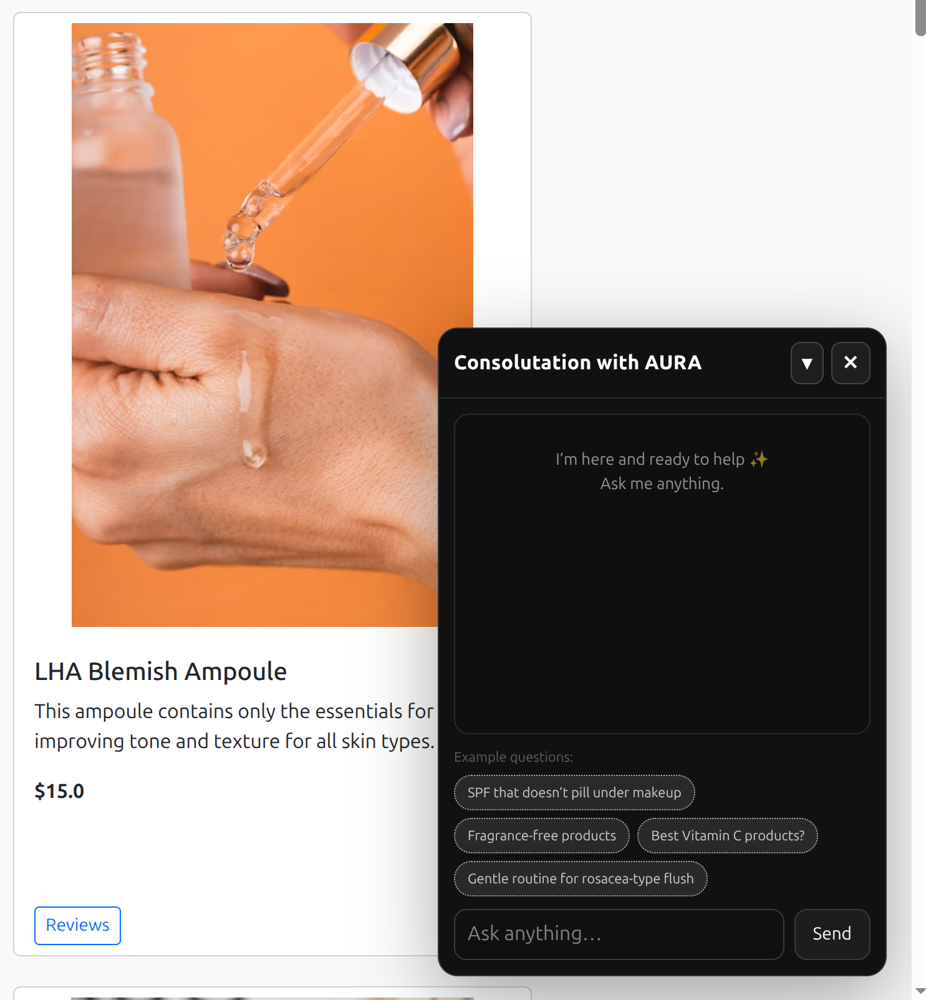
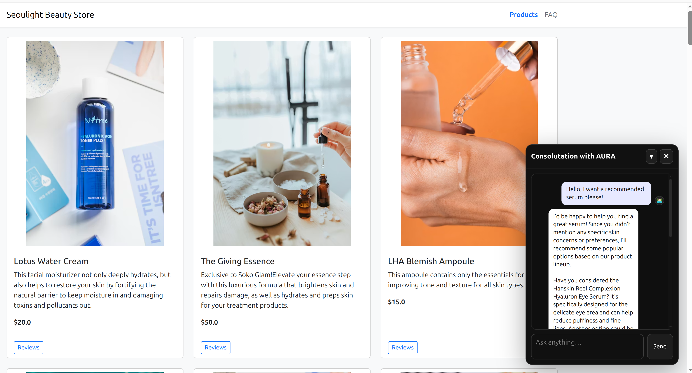
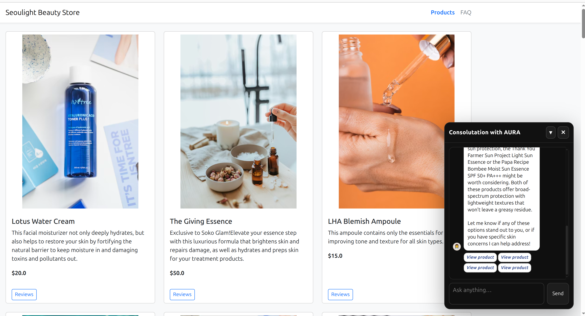

# AI Skincare Shopping Assistant

This is a prototype skincare e-commerce website with an integrated AI assistant.  
The assistant helps users ask product-related questions and explore skincare products through a conversational interface.

The project was built as a demo of how an AI assistant can be embedded into a product discovery experience. The dataset is loaded from Kaggle dataset taniadh/skin-care-products, which contains product information and reviews. Images were taken from Unsplash.

## Demo Preview

### Chat Interface



### Assistant Example






## Tech Stack

- React / Vite
- FastAPI
- Uvicorn
- Ollama
- Llama 3
- Python
- JavaScript

---

## Running the Project Locally

This project consists of:

1. A local Ollama model
2. A Python agent server
3. A Python backend server
4. A frontend development server

You need to run the services in separate terminal windows.

---

## 1. Install Ollama and Pull the Model

First, make sure Ollama is installed and running.

Then pull the Llama 3 model:

```bash
ollama pull llama3
```

You only need to do this once.

---

## 2. Start the Agent Server

In one terminal run:

```bash
cd langgraph_imp
uvicorn agent_server:agent_app --reload --port 9001
```

The agent server will run at:

```text
http://127.0.0.1:9001
```

---

## 3. Start the Backend Server

In a second terminal, navigate to fake_client and run:

```bash
cd fake_client
uvicorn server:app --host 127.0.0.1 --port 8002 --reload
```

The backend server will run at:

```text
http://127.0.0.1:8002
```

---

## 4. Start the Frontend

In a third terminal, navigate to web and run:

```bash
npm run dev
```

The frontend will usually run at:

```text
http://localhost:5173
```

or the URL shown in the terminal.

---

## Environment Variables

For the frontend to access the backend URLs, use:

```bash
export AGENT_URL=http://127.0.0.1:9001
export SERVER_URL=http://127.0.0.1:8002
```

---

## Notes

- Ollama must be running locally for the AI assistant to work.
- The agent server and backend server should both be running before testing the frontend.
- Product images are used for demonstration purposes only.
